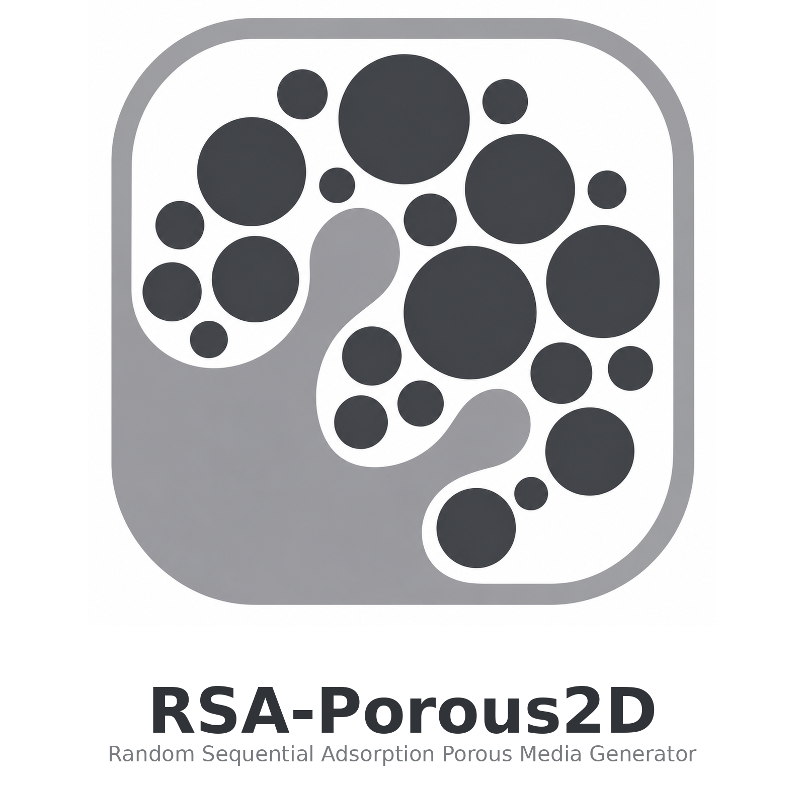
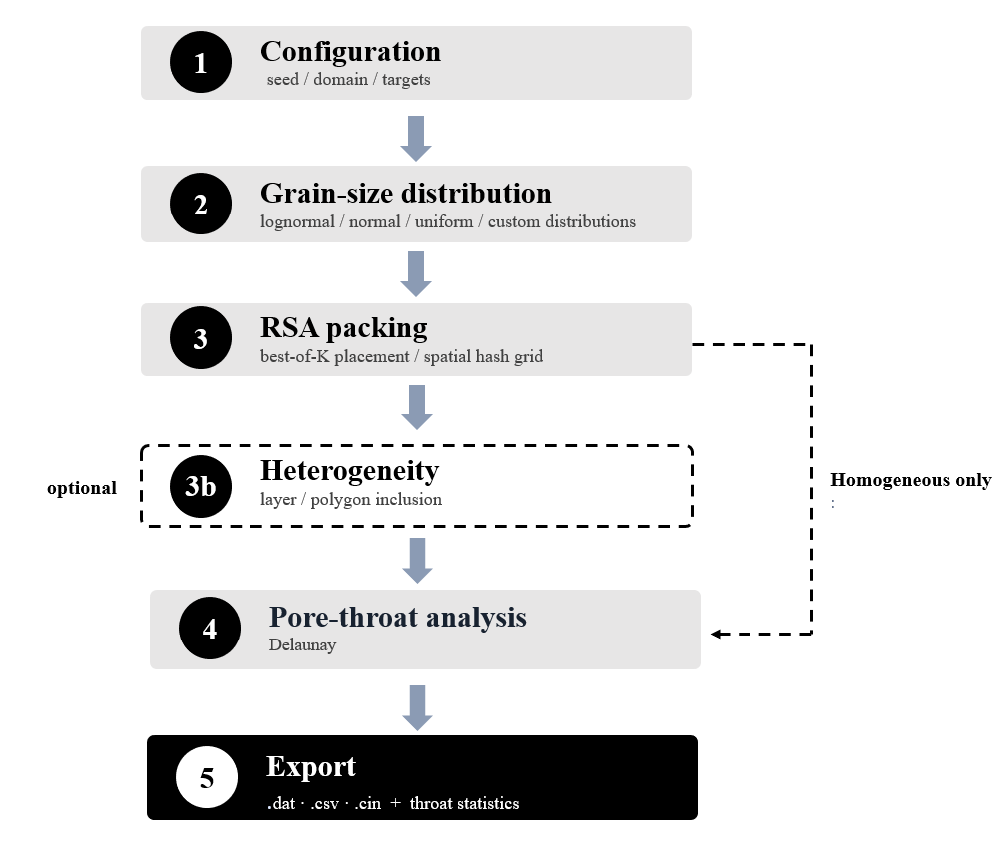
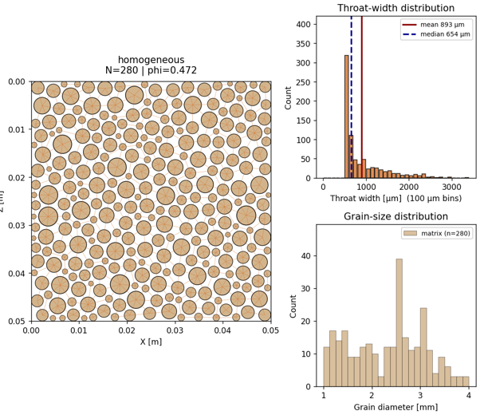
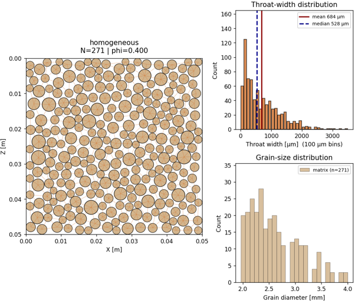
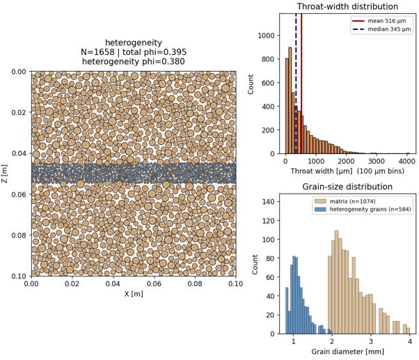
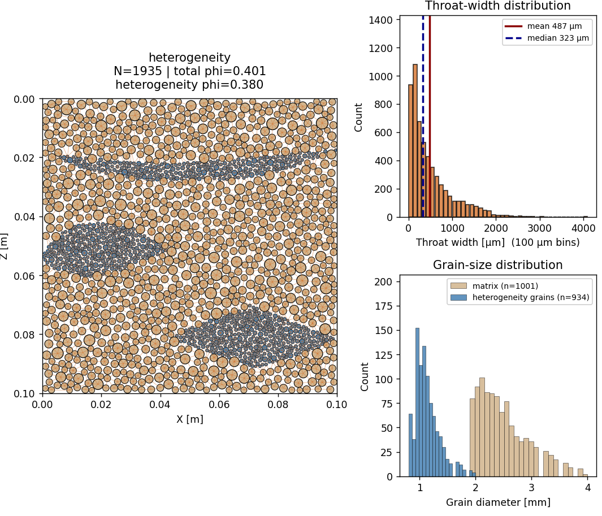

# RSA-Porous2D

<p align="center">
  
</p>

**RSA-Porous2D** is an open-source Python tool for generating reproducible two-dimensional porous media composed of polydisperse circular grains. It uses random sequential adsorption (RSA) to create controlled grain packings with user-defined grain-size distributions, target porosity, pore-throat controls, and heterogeneous regions.

The software is intended for pore-scale CFD and CFD-DEM workflows where idealised but controllable porous-media geometries are needed. Generated geometries can be exported as solver-ready grain-centre files, including a constant out-of-plane coordinate for use in three-dimensional immersed-boundary solvers.

## Main features

- Generate two-dimensional circular-grain packings in the X-Z plane.
- Use lognormal, normal, uniform, or user-defined grain-size distributions.
- Set a target porosity and report the final achieved porosity.
- Apply minimum pore-throat control using:
  - `none`: standard non-overlap RSA,
  - `soft`: biased placement to reduce narrow throats,
  - `strict`: strict minimum inter-grain clearance.
- Generate homogeneous media or heterogeneous media with:
  - rectangular layers,
  - rectangular patches,
  - polygon-defined inclusions,
  - optional roughened interfaces for rectangular regions.
- Automatically extract pore-throat statistics using a Delaunay-based neighbour graph with geometric filtering.
- Export throat-width histograms and statistics as CSV files.
- Export geometries in `.dat`, `.csv`, or MultiFlow-style `.cin` formats.
- Run from Python scripts, notebooks, command line, or the optional PySide6 GUI.
- Generate reproducible single realisations or seed-based ensembles.

## Repository structure

```text
RSA-Porous2D/
├── rsa_porous_media.py       # Core backend: generation, analysis, plotting, export
├── rsa_porous_media_gui.py   # Optional PySide6 graphical user interface
├── requirements.txt          # Python dependencies
├── README.md                 # Project documentation
├── CITATION.cff              # Citation metadata
├── LICENSE                   # MIT license
└── docs/
    └── images/
        ├── Workflow.PNG      # Software workflow figure
        ├── soft.png          # Homogeneous soft throat-control example
        ├── Strict.png        # Homogeneous hard/strict throat-control example
        ├── Layer.png         # Layered heterogeneity example
        └── Polygon.png       # Polygon heterogeneity example
```

## Installation

Clone the repository:

```bash
git clone https://github.com/Fuadqr/RSA-Porous2D.git
cd RSA-Porous2D
```

Create and activate a virtual environment:

```bash
python -m venv .venv
```

On Windows:

```bash
.venv\Scripts\activate
```

On macOS/Linux:

```bash
source .venv/bin/activate
```

Install the dependencies:

```bash
pip install -r requirements.txt
```

## Python version

RSA-Porous2D requires **Python 3.10 or newer**. Python 3.11 is recommended.

## Quick start: command line

The default configuration can be run directly:

```bash
python rsa_porous_media.py
```

This generates one porous-medium realisation using the default `CONFIG` settings in `rsa_porous_media.py` and writes the selected output files to the configured output folder.

## Quick start: Python script

```python
from rsa_porous_media import Config, main

cfg = Config(
    width=0.050,
    height=0.050,
    dist_type="lognormal",
    r_min=0.0005,
    r_max=0.0020,
    num_sizes=24,
    target_porosity=0.40,
    throat_mode="soft",
    min_throat=100e-6,
    output_format="dat",
    out_dir="outputs",
    out_basename="homogeneous_soft",
    make_plots=True,
)

results = main(cfg)
```

## Launching the GUI

To start the graphical interface:

```bash
python rsa_porous_media_gui.py
```

The GUI provides grouped input panels, live previews of the sampled grain-size distribution and domain layout, progress reporting, cancellation of active runs, visualisation of generated packings, throat-width histograms, and output-saving controls.

## Workflow and example outputs

The generation workflow starts from a user-defined configuration, followed by grain-size distribution construction and RSA packing. For heterogeneous cases, a layer or polygon-inclusion step is applied before pore-throat analysis. The final outputs include solver-ready geometry files, throat-width statistics, and optional overview figures.



### Homogeneous media

The examples below show homogeneous media generated with soft throat biasing and hard/strict throat control. The soft mode reduces the occurrence of narrow throats without enforcing a strict gap, while the hard mode enforces a minimum inter-grain clearance and can therefore produce a more open packing.

| Soft throat control | Hard/strict throat control |
|---|---|
|  |  |

### Heterogeneous media

RSA-Porous2D can also generate heterogeneous media using rectangular layers, patches, or polygon-defined inclusions with independent grain-size and porosity settings.

| Layered heterogeneity | Polygon heterogeneity |
|---|---|
|  |  |

## Output files

Depending on the selected options, RSA-Porous2D can write:

- geometry files: `.dat`, `.csv`, or `.cin`,
- throat-width statistics: `_throats.csv`,
- overview figures: `_overview.png`.

The geometry export uses the format:

```text
x y z radius
```

or, if selected:

```text
x y z diameter
```

The generated 2D coordinates are written in the X-Z plane, while `y_fixed` provides the constant out-of-plane coordinate.

## Notes on porosity and throat control

RSA packing is irreversible and may jam before reaching the requested target porosity. Therefore, porosity is treated as a **target**, not a guaranteed value. RSA-Porous2D always reports the achieved porosity.

The `soft` throat mode reduces the occurrence of narrow throats but does not enforce a strict minimum gap. The `hard` throat mode enforces a minimum inter-grain clearance, but this can reduce the achievable packing density and may prevent convergence for low target porosity or large minimum-throat values.

## Scientific use case

RSA-Porous2D is designed for controlled numerical experiments in pore-scale modelling. It is useful when researchers need repeatable geometry sets where porosity, grain-size distribution, throat width, and heterogeneity can be varied systematically. Typical applications include CFD, CFD-DEM, particle-transport simulations, numerical verification, sensitivity analysis, and idealised studies of layered or texturally heterogeneous porous media.

## Citation

If you use RSA-Porous2D in published work, please cite the associated SoftwareX paper once available:

```text
Alqrinawi, F., Fraga, B., Schneidewind, U., Comer-Warner, S., Lynch, I., & Krause, S.
RSA-Porous2D: an open-source generator of two-dimensional polydisperse circular-grain
porous media for pore-scale CFD and CFD-DEM simulation. SoftwareX. Manuscript in preparation.
```

A `CITATION.cff` file is also provided so GitHub can display citation information automatically.

## License

RSA-Porous2D is released under the **MIT License**. See the `LICENSE` file for details.

## Contact

For questions or support, contact:

**Fuad Alqrinawi**  
School of Geography, Earth and Environmental Sciences  
University of Birmingham  
Email: f.y.m.alqrinawi@bham.ac.uk
